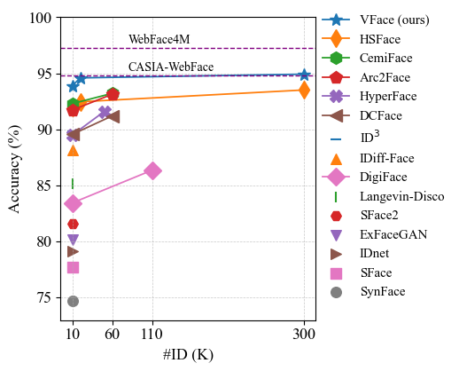
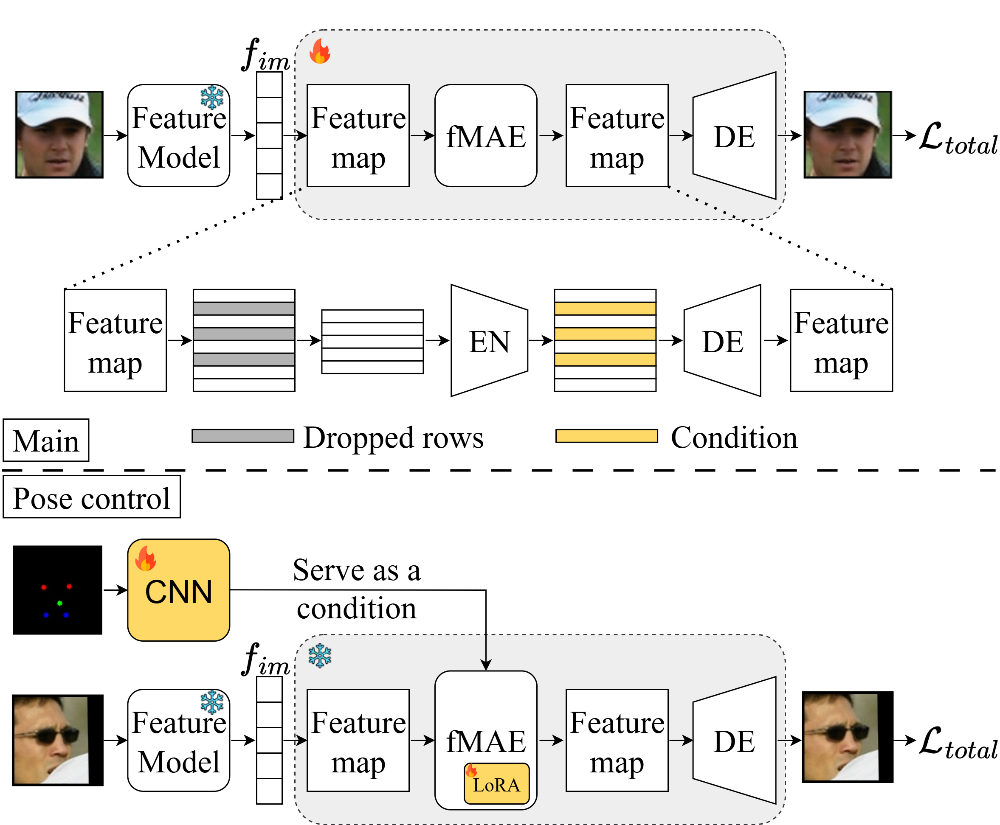

<div align="center">

# Vec2Face+ for Face Dataset Generation

[Haiyu Wu](https://haiyuwu.netlify.app/)<sup>1</sup> &emsp; [Jaskirat Singh](https://1jsingh.github.io/)<sup>2</sup> &emsp; [Sicong Tian](https://github.com/sicongT)<sup>3</sup>   

[Liang Zheng](https://zheng-lab.cecs.anu.edu.au/)<sup>2</sup> &emsp; [Kevin W. Bowyer](https://www3.nd.edu/~kwb/)<sup>1</sup> &emsp;  

<sup>1</sup>University of Notre Dame<br>
<sup>2</sup>The Australian National University<br>
<sup>3</sup>Indiana University South Bend

</div>

This is the official implementation of **[Vec2Face+](https://arxiv.org/pdf/2507.17192)**, an ID and attribute controllable face dataset generation model. This work includes:

&emsp;✅ a more training-efficient and attribute controllable model than [Vec2Face](https://github.com/HaiyuWu/vec2face).<br>
&emsp;✅ a set of synthetic FR datasets that first-time achieve a higher average accuracy than CASIA-WebFace<br>
&emsp;✅ suggesting the importance of **intra-class identity consistency**<br>
&emsp;✅ reporting the failure of the existing synthetic datasets on twin verification<br>
&emsp;**If you find Vec2Face+ useful for your research, please give a ⭐ and consider citing us 😄**<br>
```bibtex
@article{wu2025vec2face+,
  title={Vec2Face+ for Face Dataset Generation},
  author={Wu, Haiyu and Singh, Jaskirat and Tian, Sicong and Zheng, Liang and Bowyer, Kevin W},
  journal={arXiv preprint arXiv:2507.17192},
  year={2025}
}
```



# News/Updates
- [2024/07/28] 🔥 The generated [HSFace datasets](#download-datasets) are available now!
- [2024/07/28] 🔥 Our paper is on [Arxiv](https://arxiv.org/abs/2409.02979) now!
- [2025/07/27] 🔥 We release Vec2Face+!

# :wrench: Installation
```bash
conda env create -f environment.yaml
conda activate vec2face-plus
```

# Download model weights
1) The weights of the Vec2Face model and estimators used in this work can be manually from [HuggingFace](https://huggingface.co/BooBooWu/Vec2Face) or using python:
```python
from huggingface_hub import hf_hub_download
hf_hub_download(repo_id="BooBooWu/Vec2Face", filename="weights/6DRepNet_300W_LP_AFLW2000.pth", local_dir="./")
hf_hub_download(repo_id="BooBooWu/Vec2Face", filename="weights/arcface-r100-glint360k.pth", local_dir="./")
hf_hub_download(repo_id="BooBooWu/Vec2Face", filename="weights/magface-r100-glint360k.pth", local_dir="./")
hf_hub_download(repo_id="BooBooWu/Vec2Face_plus", filename="vec2face_plus/main_model.pth", local_dir="./")
hf_hub_download(repo_id="BooBooWu/Vec2Face_plus", filename="vec2face_plus/pose_model.pth", local_dir="./")
```
or
```commandline
python download_vec2face_weights.py
```
2) The weights of the FR models trained with VFace (10k, 20k, 100k, 200k) can be downloaded using python:
```python
from huggingface_hub import hf_hub_download
hf_hub_download(repo_id="BooBooWu/Vec2Face_plus", filename="fr_weights/vface10k.pth", local_dir="./")
hf_hub_download(repo_id="BooBooWu/Vec2Face_plus", filename="fr_weights/vface20k.pth", local_dir="./")
hf_hub_download(repo_id="BooBooWu/Vec2Face_plus", filename="fr_weights/vface100k.pth", local_dir="./")
hf_hub_download(repo_id="BooBooWu/Vec2Face_plus", filename="fr_weights/vface300k.pth", local_dir="./")
```

# Download datasets
The dataset used for Vec2Face+ **main model** training can be downloaded from manually from  [HuggingFace](https://huggingface.co/BooBooWu/Vec2Face) or using python:
```python
from huggingface_hub import hf_hub_download
hf_hub_download(repo_id="BooBooWu/Vec2Face", filename="lmdb_dataset/WebFace4M/WebFace4M.lmdb", local_dir="./")
```
The dataset used for Vec2Face+ **pose model** training can be downloaded from manually from  [HuggingFace](https://huggingface.co/BooBooWu/Vec2Face_plus) or using python:
```python
from huggingface_hub import hf_hub_download
hf_hub_download(repo_id="BooBooWu/Vec2Face_plus", filename="WebFace4M/WebFace4M_with_landmarks.lmdb", local_dir="./")
```
The **generated synthetic datasets** VFace10k, VFace20k, VFace100K can be downloaded using python:
```python
from huggingface_hub import hf_hub_download
hf_hub_download(repo_id="BooBooWu/Vec2Face_plus", filename="VFaces/vface10k.lmdb", local_dir="./")
hf_hub_download(repo_id="BooBooWu/Vec2Face_plus", filename="VFaces/vface20k.lmdb", local_dir="./")
hf_hub_download(repo_id="BooBooWu/Vec2Face_plus", filename="VFaces/vface100k.lmdb", local_dir="./")
```
Tip: If you want to convert .lmdb to datasets (images), please refer to [lmdb2dataset.py](https://github.com/HaiyuWu/SOTA-Face-Recognition-Train-and-Test/blob/main/utils/lmdb2dataset.py).
# Model Architecture


# ⚡Image generation
Generating images with reference image, center features, or AttrOP can be found [here](https://github.com/HaiyuWu/vec2face?tab=readme-ov-file#image-generation). It is the same as the original Vec2Face.
## Generating with pose condition
```commandline
python pose_control.py \
--batch_size 64 \
--image_file "path/to/your/image/file" \
--example 1 \
--name "test_examples" \
--use_lora \
--lora_r 8 \
--model_weights "./vec2face_plus/pose_model.pth" \
--pose_file "./landmarks/landmark_examples.txt"
```

# Training
The main model training is the same as the original Vec2Face, which can be found [here](https://github.com/HaiyuWu/vec2face?tab=readme-ov-file#vec2face-training).
## Vec2Face+ pose model training
We only provide the WebFace4M dataset (see [here](#download-datasets)), if you want to use other datasets, please referring the 
[prepare_training_set.py](scripts/prepare_training_set.py) to convert the dataset to .lmdb.

Once the dataset is prepared, run with the following command for training:
```commandline
torchrun --nproc_per_node=4 pose_training.py \
--batch_size=64 --model=vec2face_vit_base_patch16 \
--train_source=./WebFace4M/WebFace4M_with_landmarks.lmdb \
--output_dir=./workspace/landmark_guided_pose_cond \
--lr 1e-4 --warmup_epochs 1 --cosine_lr --min_lr 1e-6 \
--model_weights=vec2face_plus/main_model.pth \
--use_amp --use_lora --lora_r 8 --epochs 10
```

## FR model training
We borrowed the code from [SOTA-Face-Recognition-Train-and-Test](https://github.com/HaiyuWu/SOTA-Face-Recognition-Train-and-Test) to train the model. Please make sure the random erase is enabled by adding the following line to the configuration file:
```python
config.rand_erase = True
```
Please follow the guidance of [SOTA-Face-Recognition-Train-and-Test](https://github.com/HaiyuWu/SOTA-Face-Recognition-Train-and-Test) for the rest of training process.

## Performance

### Datasets in 0.5M scale
This table compares the existing synthetic dataset generation methods on five standard face recognition test sets. The model trained with HSFace10K has better performance on CALFW than that trained with real dataset.

| Training sets        | # images |    LFW    |  CFP-FP   |   CPLFW   |   AgeDB   |   CALFW   |   Avg.    |
|----------------------| :------: |:---------:|:---------:|:---------:|:---------:|:---------:|:---------:|
| IDiff-Face           |   0.5M   |   98.00   |   85.47   |   80.45   |   86.43   |   90.65   |   88.20   |
| DCFace               |   0.5M   |   98.55   |   85.33   |   82.62   |   89.70   |   91.60   |   89.56   |
| Arc2Face             |   0.5M   |   98.81   |   91.87   |   85.16   |   90.18   |   92.63   |   91.73   |
| DigiFace             |    1M    |   95.40   |   87.40   |   78.87   |   76.97   |   78.62   |   83.45   |
| SynFace              |   0.5M   |   91.93   |   75.03   |   70.43   |   61.63   |   74.73   |   74.75   |
| SFace                |   0.6M   |   91.87   |   73.86   |   73.20   |   71.68   |   77.93   |   77.71   |
| IDnet                |   0.5M   |   92.58   |   75.40   |   74.25   |   63.88   |   79.90   |   79.13   |
| ExFaceGAN            |   0.5M   |   93.50   |   73.84   |   71.60   |   78.92   |   82.98   |   80.17   |
| SFace2               |   0.6M   |   95.60   |   77.11   |   74.60   |   77.37   |   83.40   |   81.62   |
| Langevin-Disco       |   0.6M   |   96.60   |   73.89   |   74.77   |   80.70   |   87.77   |   82.75   |
| ID^3                 |   0.5M   |   97.68   |   86.84   |   82.77   |   91.00   |   90.73   |   89.80   |
| CemiFace             |   0.5M   |   99.03   |   91.06   |   87.65   |   91.33   |   92.42   |   92.30   |
| HSFace10K            |   0.5M   |   98.87   |   88.97   |   85.47   |   93.12   |   93.57   |   92.00   |
| **VFace10K (ours)**  |   0.5M   | **99.35** | **93.56** | **88.03** | **94.33** | **94.17** | **93.89** |
| CASIA-WebFace (Real) |  0.49M   |   99.38   |   96.91   |   89.78   |   94.50   |   93.35   |   94.79   |

### Dataset scaling up to 300K identities and 15M images

This is the uniqueness of the proposed Vec2Face, which can easily scale the dataset size up.

| Datasets             | # images |    LFW    |  CFP-FP   |   CPLFW   |   AgeDB   |   CALFW   |   Avg.    |
|----------------------|:--------:|:---------:|:---------:|:---------:|:---------:|:---------:|:---------:|
| HSFace10K            |   0.5M   |   98.87   |   88.97   |   85.47   |   93.12   |   93.57   |   92.00   |
| **VFace10K (ours)**  |   0.5M   | **99.35** | **93.56** | **88.03** | **94.33** | **94.17** | **93.89** |
| HSFace20K            |    1M    |   98.87   |   89.87   |   86.13   |   93.85   |   93.65   |   92.47   |
| **VFace20K (ours)**  |    1M    | **99.40** | **94.23** | **89.10** | **95.58** | **94.67** | **94.60** |
| HSFace100K           |    5M    |   99.25   |   90.36   |   86.75   |   94.38   |   94.12   |   92.97   |
| **VFace100K (ours)** |    4M    | **99.52** | **95.09** | **90.23** | **95.17** | **94.38** | **94.88** |
| HSFace200K           |   10M    |   99.23   |   90.81   |   87.30   |   94.22   |   94.52   |   93.22   |
| HSFace300K           |   15M    |   99.30   |   91.54   |   87.70   |   94.45   |   94.58   |   93.52   |
| **VFace300K (ours)** |   12M    | **99.57** | **94.80** | **90.43** | **95.17** | **94.70** | **94.93** |
| CASIA-WebFace (Real) |  0.49M   |   99.38   |   96.91   |   89.78   |   94.50   |   93.35   |   94.79   |

# Acknowledgements
- Thanks to the WebFace4M creators for providing such a high-quality facial dataset❤️.
- Thanks to [Hugging Face](https://huggingface.co/) for providing a handy dataset and model weight management platform❤️.
- The main code is borrowed from [Vec2Face](https://github.com/HaiyuWu/Vec2Face).
